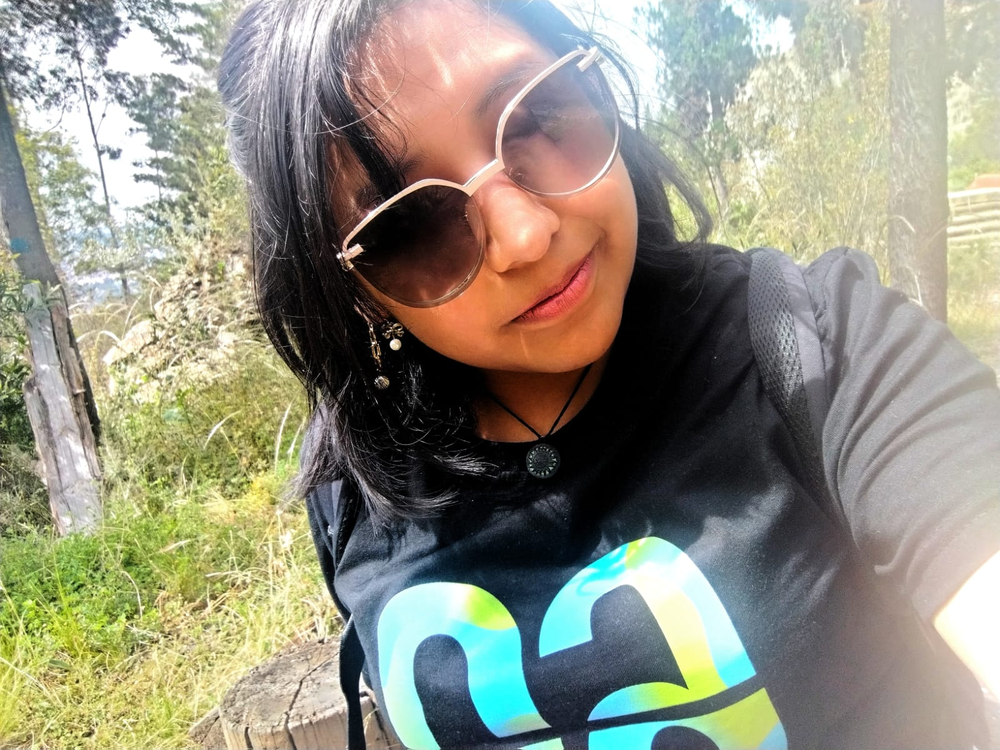
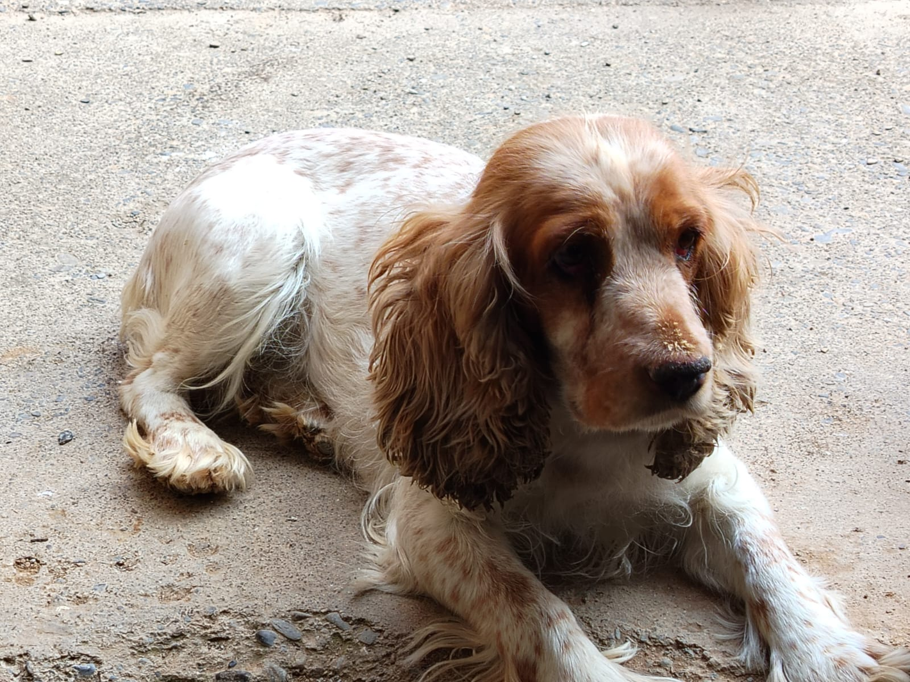
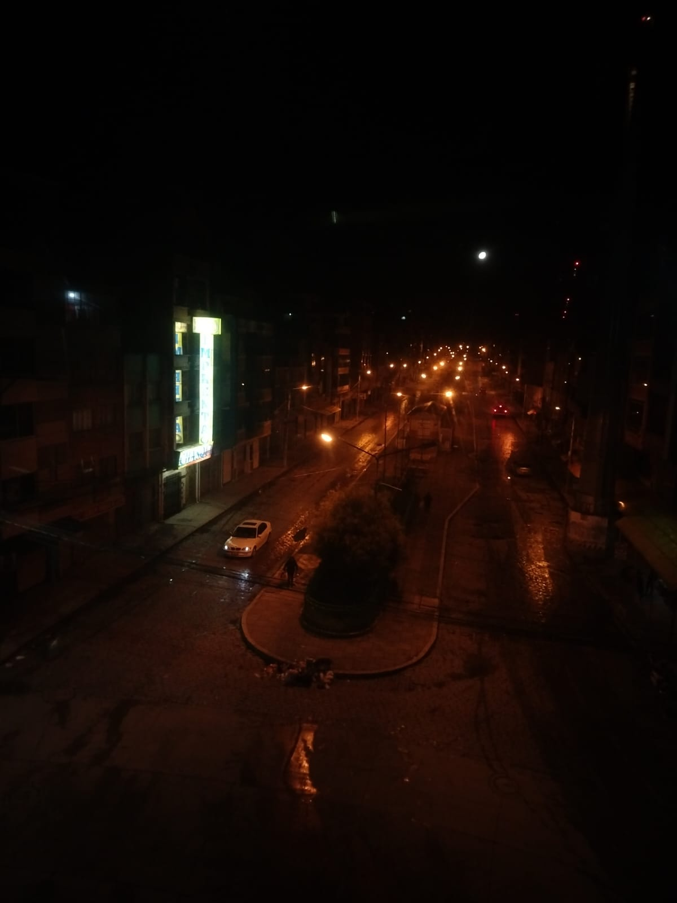

# Mi Historia
## Mi carrera
Mi nombre el Leyna Yanarico Mollinedo, soy una estudiante de Economia de la Universidad Mayor de San Andres (UMSA), hasta este momento en que escribo este texto tengo 21 años, estoy en mi último semestre de la Universidad. 
Actualmente estoy en una pasantia en la Autoridad Supervición del Sistema FInanciero (ASFI), ya tuve anteriores experiencias anteriores de pasantia presencial y virtual. Actualmente mis caracteristicas mas destacables son las siguientes:
- Persistente
- Responsable
- Sociable
- Flexible

## Mi vida 
Pero empece a vivir la vida cuando me ofreci de voluntaria en la realizanción de la **Feria Internacional del Libro** donde la verdad hice ademas de buenos amigos, obtuve experienias que nunca pense vivir o sentir, fue mi efecto mariposa. Desde ahi me anime a participar en  mas actividades. Este año me uni a varias voluntariados como ser DESAFIO ODS - EL ALTO que ya llevo un año ahi. Tambien decidi unirme a la Sociedad Cientifica de mi carrera, tengo a varios amigos, trabajo en el área de Marketing (Me encanta diseñar). 
Mis objetivos son los siguientes: 
1. Defender mi Tesis de mi actual carrera
2. Obtener una maestria o master en el extranjero en Ciencia de Datos.
3. Quedarme en el extranjero por un periodo
4. Seguir participando en voluntariados
5. Volverme poliglota

## Mis adoracionees
Pero tambien tengo una vida muy común, desayuno avena con leche, salgo a trabajar, estudio en la universidad y lo mejor de todos los dias son mis cachorrros, tengo tres en total, porque me preguntaran... en total somos tres hermanos, mi perrita personal se llama **Xiao de** de que significa *"pequeña" en chino.*

Claro eso no quiere decir que no quiera a los otros dos, el de mi hermano es una doberman que es muy cariñosa y muy amigable, ella es mi otra hija, me cuida me protege. El tercero es mi hermano pero él si es netamente de mi hermana, ella lo crio desde muy pequeño, es como su hijo, yoo seria considerada su tia (tan joven y siendo madre y tia)
Un dato mas me encanta la música y la fotografia y la peliculas. En este momento estoy en un proyecto de llamado *Escuela de Cine para Jovenes Cineastas de Derechos Humanos*, uno de mis primeros proyecto al cual me uno al cual me encanto unirme. 

## Mi cita personal
Para mejor comprención vean Spiderman Across: 
> ¿Cuándo sabre que soy Spider-Man? - No lo sabras.
 Solo es eso Miles... un salto de fe (Bob Persichetti, 2018)